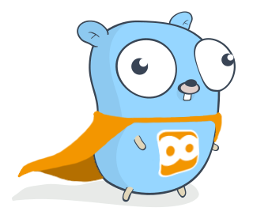

[](https://godoc.org/github.com/roboticeyes/gorexos)
[](https://travis-ci.org/roboticeyes/gorexos)
[](https://goreportcard.com/report/github.com/roboticeyes/gorexos)

<p align="center">
  
</p>

# GoREXos

The `gorexos` library implements functionality which is useful to communicate with the REXos. Please
see more information about REXos [here](https://www.rexos.org). The library can easily be integrated into your Go
project. It can help you to get started with REX as a developer.

## Installation

> You can install Go by following [these instructions](https://golang.org/doc/install). Please note that Go >= 1.13. is required!

First, clone the repository to your local development path, and let go download all dependencies:

```
go mod tidy
```

This should download all required packages.

## Usage

Make sure that you just include the `gorexos` library in your application:

```go
package main

import (
    "github.com/roboticeyes/gorexos/http/rexos"
)
```

## References

* [REXos](https://www.rexos.org)
* [REX](https://app.rexos.cloud)
